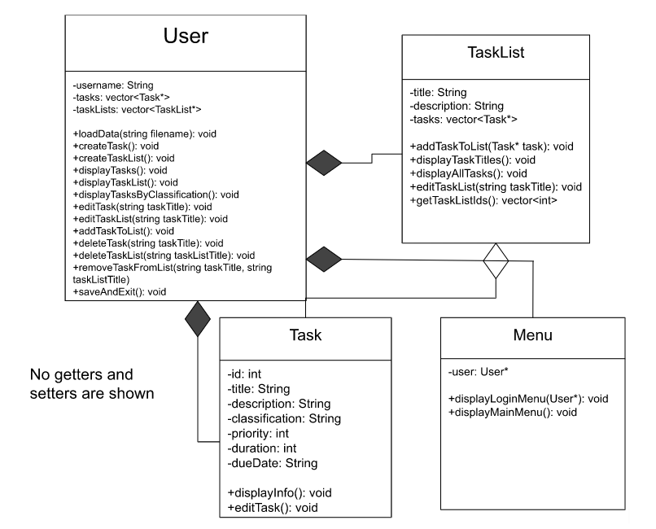
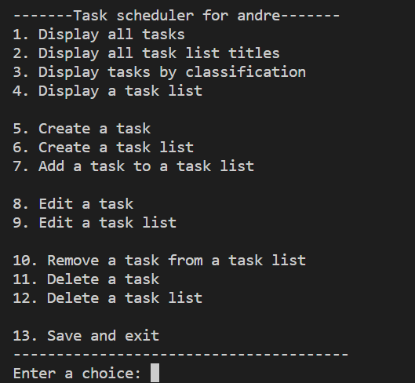
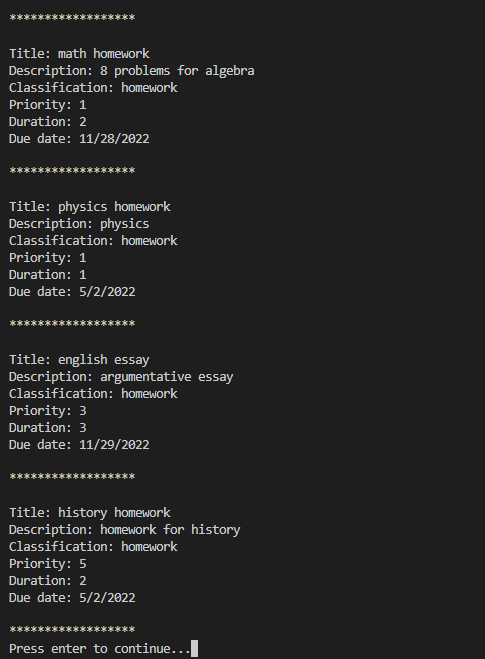
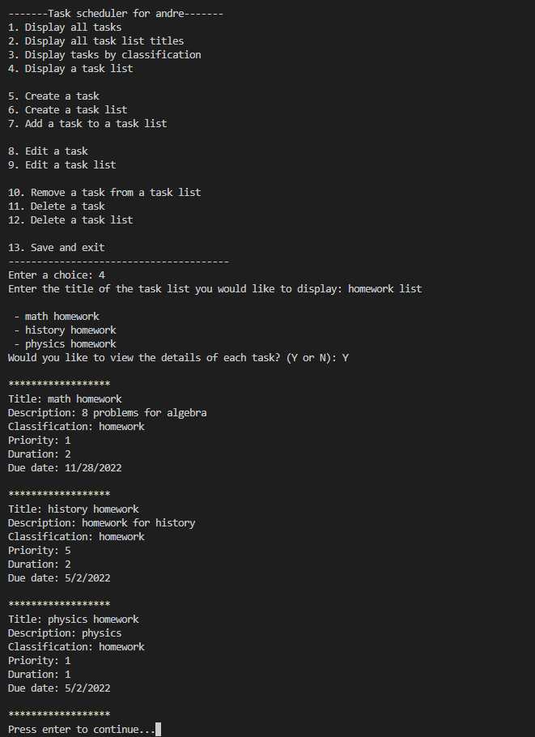
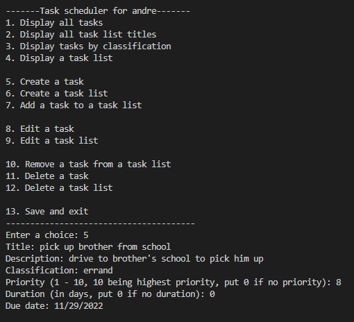
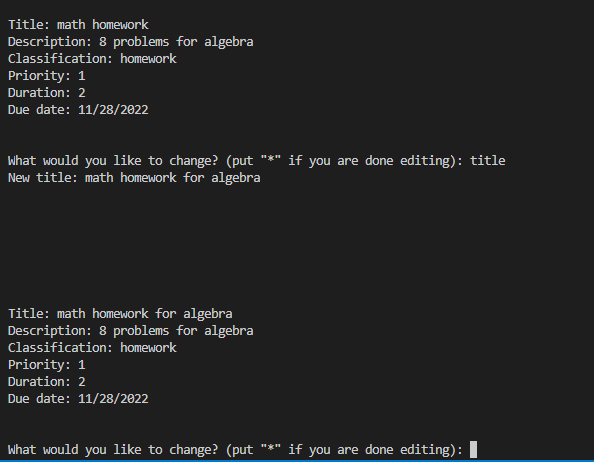

[](https://classroom.github.com/online_ide?assignment_repo_id=8878159&assignment_repo_type=AssignmentRepo)
# Task Scheduler
Authors: [Andre Nguyen](https://github.com/nguyena537), [Alan Ngo](https://github.com/ngoalan), [Koosha Taban](https://github.com/kooshataban), [Miguel](https://github.com/mgall063)

* The project is important because it allows the user to be able to organize tasks to be completed with multiple options to help designate which ones have a higher priority over others. Traditionally organizing tasks, whether mentally or on paper, can be quite overwhelming or confusing at times. A task scheduler like this is a nice quality of life tool that can ease the burden of organizing tasks.
* We plan to use C++, Visual Studio Code, Github
* The user will input tasks or assignments that they wish to complete along with a due date, and the program will then output a list of those assignments based on the due date inputted or which one was prioritized by the user.
* The user will be able to create tasks including a title, description, classification, priority, duration, and due date.  Some of these features can be optional.  In addition, users can create lists of multiple tasks, and will be able to display, edit, and delete these lists.  They'll also be able to undo these operations if needed.
 
 
## Class Diagram
 
 <div align="center">
    
 </div>
 
 <p> 
   When the program starts, The user will be able to create a new user or enter an existing username.  Each user will have their own file named “&lt;username&gt;.txt”. After a username has been entered, a User object will be created and data will be extracted from the corresponding user file and put into the tasks and taskLists vectors. 

   The user will then be able to display, create, edit, and delete tasks and taskLists.  After they are done, they can save and exit, which writes to their            corresponding user file and exits the program.
 
   The Task and TaskList classes are in a composition relationship with the User class because without the User, the tasks and task lists cannot exist on their own.  The tasks and task lists belong to the user, so if the user was to be deleted, their task and task lists would be deleted as well.  However, the Task class is in an aggregation relationship with the TaskList class because the tasks can exist without lists.  The lists are there just to provide organization for the tasks, and the tasks do not need to be in a list.  The Menu class is in an aggregation relationship with the User class because it cannot exist without the user.
</p>
 
 ## Screenshots
<details>
   <summary>Screenshots of input/output</summary>
      <div align="center">
         
         
         
         
         
      </div>
</details>

 ## Installation/Usage
 In the terminal, run this command to clone this git repository.
 ```
 git clone https://github.com/cs100/final-project-anguy794-ango064-ktaba005-mgall063.git
 ```
 Run CMake to create the Makefile.
 ```
 cmake .
 ```
 Run make to compile the program.
 ```
 make
 ```
 Use the executable to run the program.
 ```
 ./task_scheduler
 ```
 
 ## Testing
 Throughout the development process, we tested our program but running our own user input and seeing if the program acts the way it is designed to.
 
